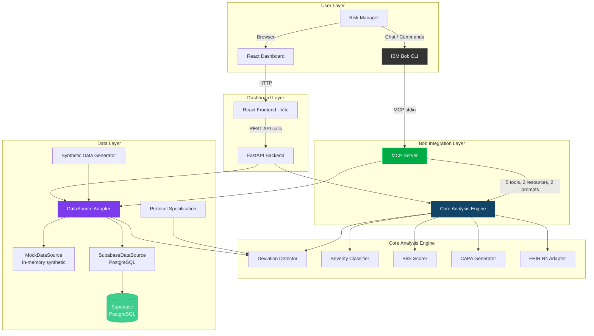

# Architecture

## System Architecture

TrialGuard AI has three access paths — IBM Bob via MCP, a REST API for the dashboard, and a FHIR R4 export endpoint — all sharing the same core analysis engine. Data is persisted in Supabase (PostgreSQL) or runs in-memory via the DataSource adapter.



## Components

| Component | Technology | Responsibility |
|---|---|---|
| MCP Server | MCP Python SDK v2 | Exposes analysis tools to IBM Bob via stdio transport |
| Core Engine — Deviation Detector | Python (dataclasses) | Compares patient records against protocol specification |
| Core Engine — Severity Classifier | Python (rule-based) | ICH E6(R2) GCP classification (Major/Minor/Administrative) |
| Core Engine — Risk Scorer | Python (composite scoring) | Site-level risk scoring with leading indicators |
| Core Engine — CAPA Generator | Python (template engine) | Generates regulatory-standard CAPA reports |
| FHIR R4 Adapter | Python | Exports data in HL7 FHIR R4 format (Patient, Encounter, MedicationAdministration, DetectedIssue) |
| DataSource Adapter | Python (ABC interface) | Clean swap point: MockDataSource (in-memory) or SupabaseDataSource (persistent) |
| Supabase (PostgreSQL) | Supabase | Persistent storage for sites, patients, visits, deviations, risk profiles, CAPA reports |
| Synthetic Data Generator | Python (seeded random) | Produces 200+ sites, 600+ patients, 5000+ visits |
| Protocol Specification | Python (dataclass model) | PHOENIX-301 Phase III NSCLC trial protocol |
| REST API | FastAPI + Uvicorn | Serves dashboard endpoints (9 routes including FHIR export) |
| Frontend Dashboard | React 18 + Vite 5 | Premium dark-themed clinical operations UI |
| Charts | Recharts | Severity donuts, risk tier charts, trend bar charts |

## Data Flow

1. **At startup:** The DataSource adapter checks environment variables. If `SUPABASE_URL` is set, it connects to Supabase and loads persisted data. Otherwise, it falls back to the in-memory synthetic data generator — creating 210 sites with 600+ patients and 5000+ visits using a fixed random seed.

2. **Deviation detection:** The engine compares every patient visit against the PHOENIX-301 protocol — checking visit timing windows, dose accuracy, co-medication conflicts, and assessment completeness.

3. **Classification:** Each detected deviation is auto-classified by ICH E6(R2) severity using codified thresholds (e.g., >30 days late = Major, 7–30 days = Minor, <7 days = Administrative).

4. **Risk scoring:** Sites are scored 0–100 using a composite of severity-weighted deviation count, trend direction, repetition patterns, and recency bias. Scores are bucketed into tiers: Critical (75–100), High (50–74), Medium (25–49), Low (0–24).

5. **Persistence (Supabase path):** When using SupabaseDataSource, all computed results (deviations, risk profiles) are stored in PostgreSQL via Supabase, enabling persistence across restarts and team collaboration.

6. **API serving:** FastAPI exposes the computed results via REST endpoints. The React dashboard consumes these on page load. A dedicated FHIR R4 export endpoint (`/api/export/fhir/{site_id}`) returns site data in industry-standard HL7 FHIR format.

7. **Bob access:** IBM Bob connects via MCP stdio and can call any of the 5 tools to query the same analysis engine conversationally.

## Data Source Adapter Architecture

The DataSource adapter provides a clean interface boundary:

```
[Data Source] → [Ingestion Adapter] → [Deviation Engine]
```

- **Today:** `MockDataSource` generates synthetic data in-memory (zero-config demo)
- **With Supabase:** `SupabaseDataSource` reads pre-seeded data from PostgreSQL (persistent, production-like)
- **In production:** A new `EDCApiSource` would call a real EDC/EHR API (e.g., Medidata Rave) — with zero changes to detection, scoring, or reporting logic

This is a one-file swap. Everything downstream — detection, classification, scoring, reporting — never needs to know or care which data source it's consuming.

## FHIR / CDISC Alignment

TrialGuard AI data is structured to align with two industry standards:

| Standard | Purpose | How We Use It |
|---|---|---|
| **HL7 FHIR R4** | Hospital/EHR data exchange standard | Export endpoint produces FHIR Bundles with Patient, Encounter, MedicationAdministration, MedicationStatement, and DetectedIssue resources |
| **CDISC SDTM** | Clinical trial data submission standard | Data carries SDTM domain annotations (DM, SV, CM, FA) for regulatory alignment |

This means TrialGuard AI can ingest real EHR exports with minimal transformation, and its output is already formatted for regulatory review.

## Security Considerations

- All data is synthetic — no real patient health information (PHI) is stored or transmitted
- API keys (Supabase, watsonx.ai) are stored in environment variables via `.env`, never committed to git
- `.env` is in `.gitignore` — only `.env.example` with dummy values is committed
- Supabase Row Level Security (RLS) is enabled on all tables
- CORS is configured for local development; production deployment would restrict origins
- MCP server runs via stdio (local subprocess) — no network exposure

## Scalability Notes

The current implementation supports two deployment modes:

| Mode | Storage | Use Case |
|---|---|---|
| **MockDataSource** | In-memory | Zero-config demo, hackathon evaluation |
| **SupabaseDataSource** | PostgreSQL (Supabase) | Persistent storage, team collaboration, production path |

In a full production environment:
- The core analysis engine is stateless and could be horizontally scaled behind a load balancer
- Deviation detection could be run incrementally (new visits only) rather than full-scan
- The MCP server could be deployed as a remote HTTP service instead of stdio
- Risk scoring could be updated on a schedule (e.g., every hour) rather than computed at startup
- Supabase real-time subscriptions could push live updates to the dashboard
