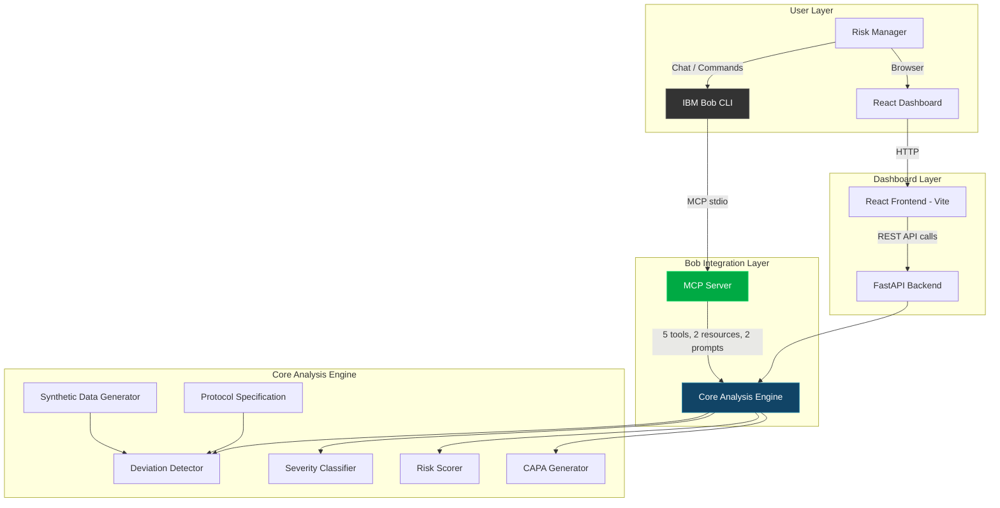

# Architecture

## System Architecture

TrialGuard AI has three access paths: IBM Bob via MCP, a REST API for the dashboard, and the core analysis engine that both share.

## Components

| Component | Technology | Responsibility |
|---|---|---|
| MCP Server | MCP Python SDK v2 | Exposes analysis tools to IBM Bob via stdio transport |
| Core Engine — Deviation Detector | Python (dataclasses) | Compares patient records against protocol specification |
| Core Engine — Severity Classifier | Python (rule-based) | ICH E6(R2) GCP classification (Major/Minor/Administrative) |
| Core Engine — Risk Scorer | Python (composite scoring) | Site-level risk scoring with leading indicators |
| Core Engine — CAPA Generator | Python (template engine) | Generates regulatory-standard CAPA reports |
| Synthetic Data Generator | Python (seeded random) | Produces 200+ sites, 600+ patients, 5000+ visits |
| Protocol Specification | Python (dataclass model) | PHOENIX-301 Phase III NSCLC trial protocol |
| REST API | FastAPI + Uvicorn | Serves dashboard endpoints (7 routes) |
| Frontend Dashboard | React 18 + Vite 5 | Premium dark-themed clinical operations UI |
| Charts | Recharts | Severity donuts, risk tier charts, trend bar charts |

## Data Flow

1. **At startup:** The synthetic data generator creates 210 sites with 600+ patients and 5000+ visits using a fixed random seed (reproducible). 8 "problem sites" are injected with elevated deviation rates.

2. **Deviation detection:** The engine compares every patient visit against the PHOENIX-301 protocol — checking visit timing windows, dose accuracy, co-medication conflicts, and assessment completeness.

3. **Classification:** Each detected deviation is auto-classified by ICH E6(R2) severity using codified thresholds (e.g., >30 days late = Major, 7–30 days = Minor, <7 days = Administrative).

4. **Risk scoring:** Sites are scored 0–100 using a composite of severity-weighted deviation count, trend direction, repetition patterns, and recency bias. Scores are bucketed into tiers: Critical (80+), High (60–79), Medium (40–59), Low (0–39).

5. **API serving:** FastAPI exposes the computed results via REST endpoints. The React dashboard polls these on page load.

6. **Bob access:** IBM Bob connects via MCP stdio and can call any of the 5 tools to query the same analysis engine conversationally.

## Security Considerations

- All data is synthetic — no real patient health information (PHI) is stored or transmitted
- API keys (for future watsonx.ai integration) are stored in environment variables via `.env`, never committed to git
- `.env` is in `.gitignore` — only `.env.example` with dummy values is committed
- CORS is configured for local development; production deployment would restrict origins
- MCP server runs via stdio (local subprocess) — no network exposure

## Scalability Notes

The current implementation runs entirely in-memory with synthetic data, which is appropriate for the hackathon prototype. In a production environment:

- The core analysis engine is stateless and could be backed by a PostgreSQL database for persistent storage
- The FastAPI backend is stateless and could be horizontally scaled behind a load balancer
- Deviation detection could be run incrementally (new visits only) rather than full-scan
- The MCP server could be deployed as a remote HTTP service instead of stdio
- Risk scoring could be updated on a schedule (e.g., every hour) rather than computed at startup
